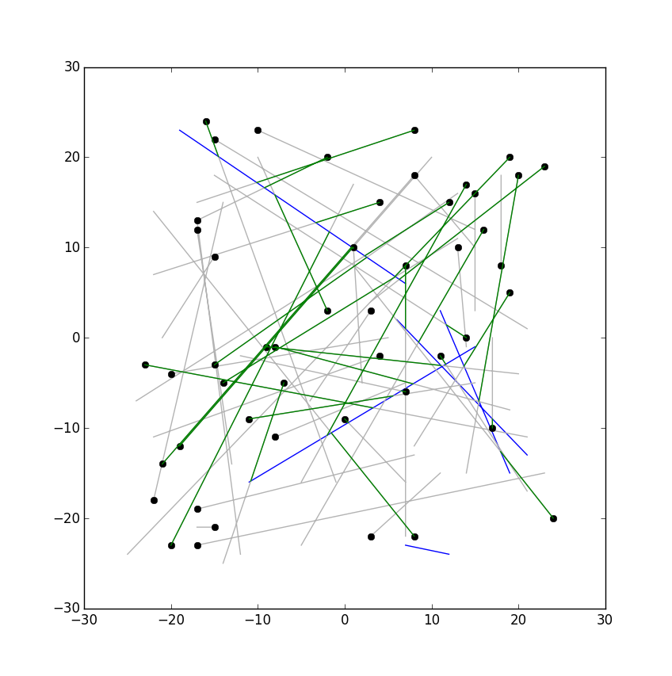

python-computational-geometry
=============================

Python library for vectorized geometry maths. 

Intended features:

    Fast, vecorized computations on sets of geometry objects

    Functions implemented in numpy and possibly cgal or other C libs

    Object oriented geometries with complimentary methods 
      (Intersect(bezier1,linesegs1) Intersect(linesegs1,bezier1)
      both use the same function under the hood.

    Just-in-time computation and caching of properties (like 
      line normals, matrix determinants, etc.) to minimize 
      redundant or uneeded calculations.

Example usage (rudimentary ray casting):

    import matplotlib.pyplot as plt
    from composite_geometry import Lines2d
    from base_geometry import Vec2d
    from results import LineLineIntersect

    #One dimensional collection of lines
    n = 5 
    begins1 = np.random.randint(-25,25,(n,2))
    ends1 = np.random.randint(-25,25,(n,2))
    segs1 = Lines2d(begin=begins1,end=ends1)

    #More complicated collection of lines
    m=7  
    begins2 = np.random.randint(-25,25,(m,m,2))
    ends2 =np.random.randint(-25,25,(m,m,2))
    segs2 = Lines2d(begin=begins2,end=ends2)

    #plot segments
    xs,ys = export4mpl(segs1)
    plt.plot(xs,ys,'b') #blue solid
    xs,ys = export4mpl(segs2)
    plt.plot(xs,ys,color='.70') #gray
    
    xs,ys = export4mpl(segs2['begin'])
    plt.plot(xs,ys,'ko') #black dots

    #Set up result, but don't calculate
    result = LineLineIntersect(segs1,segs2)

    #plot all intersections
    #pts = result.points['world']
    #xs,ys =export4mpl(pts) 
    #plt.plot(xs,ys,'ro')

    ###plot segs1 from begining to first intersection###
    
    #Get seg2's parameter of intersection 
    ub = result.points[segs2] 

    axis = 2  #Manually set axis of segs1. TODO: fix this
    shortest = np.nanmin(ub.arr,axis=axis)
    pts = segs2.eval_param(shortest)

    ##plot all first intersections
    ##xs,ys =export4mpl(pts) 
    ##plt.plot(xs,ys,'ro')
    
    #plot the lines from begining to first intersection.
    short_lines = Lines2d(begin=segs2['begin'].arr, end=pts.arr)
    xs,ys =export4mpl(short_lines) 
    plt.plot(xs,ys,'g') #solid green
    plt.show()

Resulting Graph:

